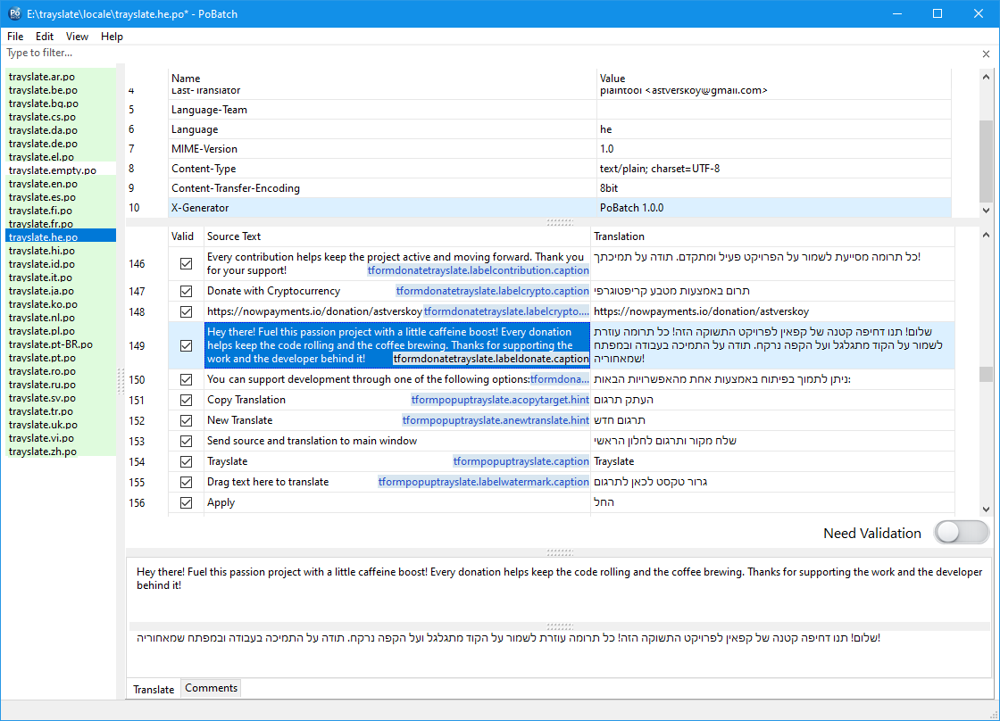

<p align="center">
  
</p>

<h1 align="center">PoBatch</h1>

PoBatch is an easy-to-use PO file editor for l10n workflows. It displays source strings and translations in a grid, allowing selection of columns or rows and bulk copy and paste operations. This makes it easy to quickly update translations within a PO file.

[](https://www.gnu.org/licenses/gpl-3.0)
[](https://www.lazarus-ide.org/)
[](#)
[](https://github.com/plaintool/pobatch/releases/latest)



## Installation

[](https://github.com/plaintool/pobatch/releases/latest)

### Windows

Several installer options are available on the releases page:

| Description | Files |
|-------------|-------|
| **User installer (MSI)** — installs the application **for the current user** | `pobatch‑x64.msi`<br>`pobatch‑x86.msi` |
| **System installer (MSI)** — installs the application **for all users on the system** | `pobatch‑x64‑allusers.msi`<br>`pobatch‑x86‑allusers.msi` |
| **Portable version** — saves its settings to `form_settings.json` if it is near the executable; otherwise, in the user directory | `pobatch‑x86‑x64‑portable.zip` |

Download the installer from the [releases page](https://github.com/plaintool/pobatch/releases), run it, and follow the on-screen instructions. After installation, you can launch PoBatch from the Start menu or from the desktop shortcut.

---

### Linux
### *Debian-like systems (Debian, Ubuntu, etc.)*

Download the appropriate `.deb` package for your system from the [releases page](https://github.com/plaintool/pobatch/releases), or use `wget` directly. An example of using `wget` is provided on the release page.

If you downloaded the package manually, you can also install it via:
```bash
sudo dpkg -i /path/to/pobatch.deb
```
If there are missing dependencies, fix them by running:
```bash
sudo apt-get install -f
```

### *RPM-based systems (Fedora, RHEL, CentOS, openSUSE, etc.)*

Download the appropriate `.rpm` package for your system, or use `wget` directly. An example of using `wget` is provided on the release page.

If you downloaded the package manually, you can also install it via:
```bash
sudo dnf install /path/to/pobatch.rpm
```
If there are missing dependencies, fix them by running:
```bash
sudo dnf install -y gtk2
```

## Donate 💖

If you like this application, you can read how to support it [here](https://plaintool.github.io/notetask/donate.htm).

## Licensing

PoBatch is licensed under the GPL v3 license. See the LICENSE file for details.

The PoBatch application uses third-party resources licensed as described in the [THIRD_PARTIES](THIRD_PARTIES) file.